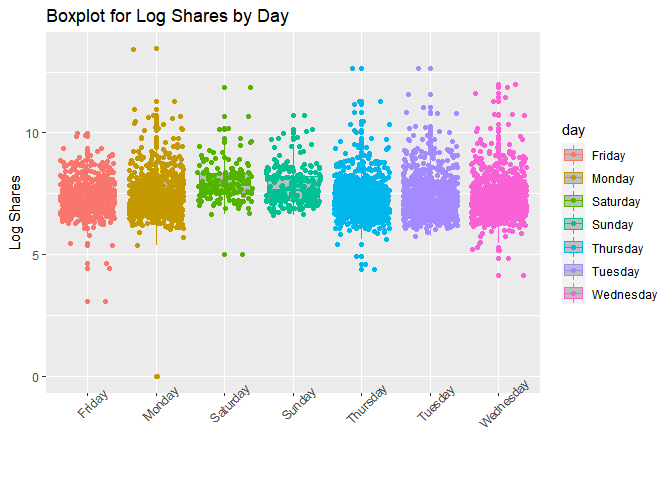
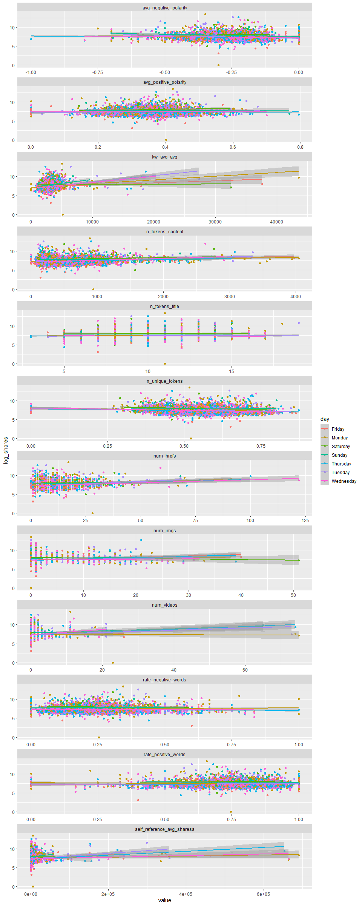
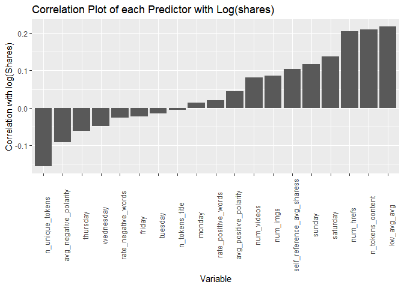
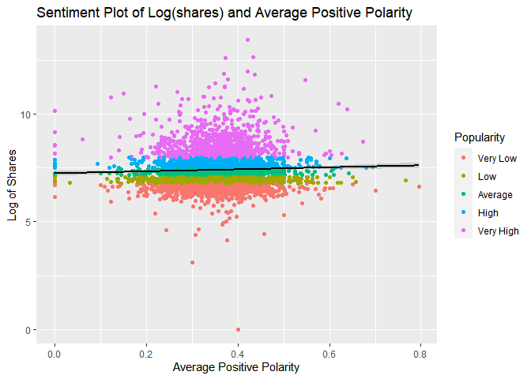
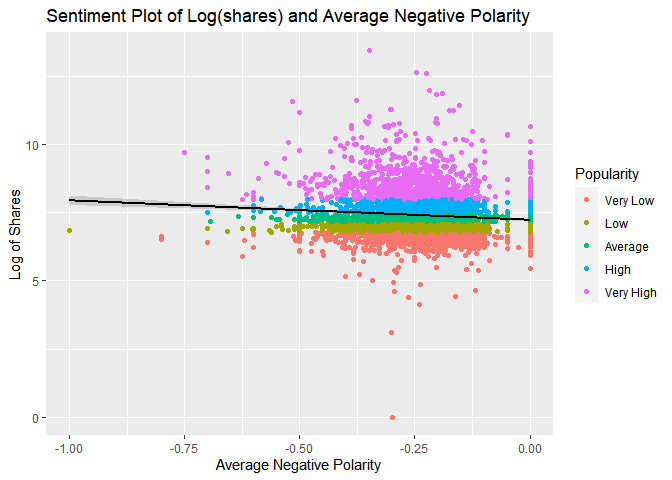
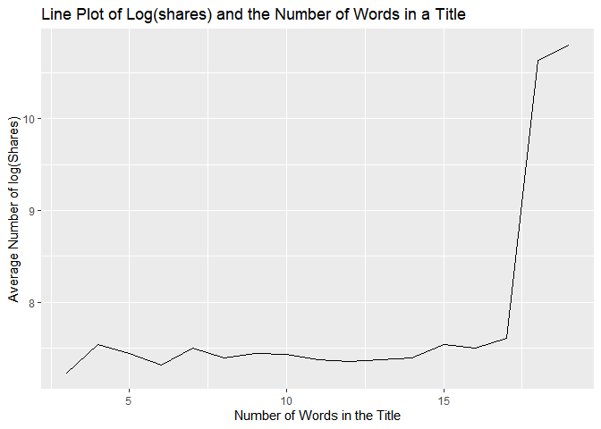
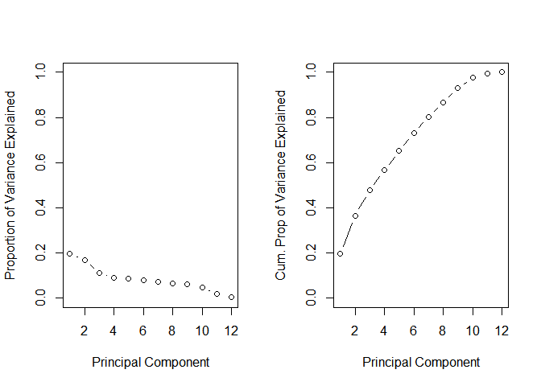

Project-3-Group-A
================
Brant Armstrong, Naman Goel

-   <a href="#necessary-packages" id="toc-necessary-packages">Necessary
    Packages</a>
-   <a href="#introduction" id="toc-introduction">Introduction</a>
-   <a href="#reading-in-data" id="toc-reading-in-data">Reading in Data</a>
-   <a href="#summarization" id="toc-summarization">Summarization</a>
    -   <a href="#boxplot-of-logshares-by-day"
        id="toc-boxplot-of-logshares-by-day">Boxplot of Log(shares) by Day.</a>
    -   <a
        href="#scatterplot-of-all-continuous-predictors-versus-logshares-in-a-facet-wrap-colored-based-on-day"
        id="toc-scatterplot-of-all-continuous-predictors-versus-logshares-in-a-facet-wrap-colored-based-on-day">Scatterplot
        of all Continuous Predictors Versus Log(shares) in a Facet Wrap Colored
        Based on Day.</a>
    -   <a href="#correlation-table-and-plot-of-each-variable-with-shares"
        id="toc-correlation-table-and-plot-of-each-variable-with-shares">Correlation
        Table and Plot of Each Variable with Shares</a>
    -   <a href="#sentiment-plots" id="toc-sentiment-plots">Sentiment Plots</a>
        -   <a href="#positive-polarity-plot"
            id="toc-positive-polarity-plot">Positive Polarity Plot</a>
        -   <a href="#negative-polarity-plot"
            id="toc-negative-polarity-plot">Negative Polarity Plot</a>
    -   <a href="#average-number-of-shares-per-words-in-title"
        id="toc-average-number-of-shares-per-words-in-title">Average number of
        shares per words in title</a>
    -   <a
        href="#summary-statistics-using-the-describe-function-from-the-psych-package-sorted-by-standard-deviation"
        id="toc-summary-statistics-using-the-describe-function-from-the-psych-package-sorted-by-standard-deviation">Summary
        statistics using the <code>describe</code> function from the
        <code>psych</code> package sorted by standard deviation.</a>
    -   <a href="#contingency-tables-of-images-and-videos-by-day"
        id="toc-contingency-tables-of-images-and-videos-by-day">Contingency
        Tables of Images and Videos by Day</a>
        -   <a href="#table-for-images-by-day"
            id="toc-table-for-images-by-day">Table for Images by Day</a>
        -   <a href="#table-for-videos-by-day"
            id="toc-table-for-videos-by-day">Table for videos by Day</a>
    -   <a href="#principal-components-scree-plot"
        id="toc-principal-components-scree-plot">Principal Components Scree
        plot</a>
-   <a href="#modeling" id="toc-modeling">Modeling</a>
    -   <a href="#linear-regression-models"
        id="toc-linear-regression-models">Linear Regression Models</a>
        -   <a href="#principal-components-regression"
            id="toc-principal-components-regression">Principal Components
            Regression</a>
        -   <a href="#forward-selection" id="toc-forward-selection">Forward
            Selection</a>
    -   <a href="#ensemble-methods" id="toc-ensemble-methods">Ensemble
        Methods</a>
        -   <a href="#random-forest" id="toc-random-forest">Random Forest</a>
        -   <a href="#boosted-tree" id="toc-boosted-tree">Boosted Tree</a>
    -   <a href="#selecting-top-performing-model"
        id="toc-selecting-top-performing-model">Selecting Top Performing
        Model</a>

# Necessary Packages

``` r
library(tidyverse)
library(caret)
library(corrplot)
library(corrr)
library(psych)
library(rmarkdown)
library(kableExtra)
library(timereg)
```

# Introduction

The data set provided to us describes the features (token details,
keywords, day of the week etc) for each record and different channels.
The purpose of the analysis which will be performed as part of the
project is to predict the performance of each individual channel. The
channel performance is measured by the number of shares which in
modelling context is the response variable. The shares variable has been
converted into log shares for better analysis and plotting purposes. The
url for each record and time delta which is days between article
publication are removed as they are not useful in predicting shares.
There variables for each data channel are used as parameters to create
unique outputs for each channel. Finally, four modelling methodologies
are PCA regression, forward subset linear regression, and ensemble
technique such as random forest and boosting are fitted on the training
data. To evaluate the model fit, the testing is performed on the test
data and RMSE is calculated. These RMSE values are compared for all four
models and the one with the lowest RMSE is declared as a winner for a
particular channel.

Variables used as predictors in our models along with descriptions:

1.  `num_imgs`: Number of images
2.  `n_tokens_content`: Number of words in the content
3.  `n_unique_tokens`: Rate of unique words in the content
4.  `rate_positive_words`: Rate of positive words among non-neutral
    tokens
5.  `rate_negative_words`: Rate of negative words among non-neutral
    tokens
6.  `monday`: A binary variable with 1 for TRUE and 0 for False
7.  `tuesday`: A binary variable with 1 for TRUE and 0 for False
8.  `wednesday`: A binary variable with 1 for TRUE and 0 for False
9.  `thursday`: A binary variable with 1 for TRUE and 0 for False
10. `friday`: A binary variable with 1 for TRUE and 0 for False
11. `saturday`: A binary variable with 1 for TRUE and 0 for False
12. `sunday`: A binary variable with 1 for TRUE and 0 for False
13. `num_videos`: Number of videos
14. `num_hrefs`: Number of links
15. `kw_avg_avg`: Avg. keyword (avg. shares)
16. `n_tokens_title`: Number of words in the title
17. `self_reference_avg_sharess`: Avg. shares of referenced articles in
    Mashable
18. `avg_positive_polarity`: Avg. polarity of positive words
19. `avg_negative_polarity`: Avg. polarity of negative words

# Reading in Data

``` r
df <- read_csv("./OnlineNewsPopularity.csv")
# Creating a vector of the names of the variables we want to use in our analysis
interest_vars <- c("num_imgs", "n_tokens_content", "n_unique_tokens", "rate_positive_words",
                   "rate_negative_words", "num_videos", "num_hrefs", "kw_avg_avg", "n_tokens_title",                               "self_reference_avg_sharess", "avg_positive_polarity", "avg_negative_polarity", "log_shares",                    "monday", "tuesday", "wednesday", "thursday", "friday", "saturday", "sunday", "data_channel")
#Creating a new variable for to contain data channels and removing the old one.
df <- df %>%
  mutate(data_channel = if_else(
    data_channel_is_bus == 1,
    "Business",
    if_else(
      data_channel_is_entertainment == 1,
      "Entertainment",
      if_else(
        data_channel_is_lifestyle == 1,
        "Lifestyle",
        if_else(
          data_channel_is_socmed == 1,
          "Socmed",
          if_else(data_channel_is_tech == 1, "Tech", "World")))))) %>% 
  #Removing non-predictors and old data channel variables
  select(-c(url, timedelta, data_channel_is_bus, data_channel_is_entertainment,
            data_channel_is_socmed, data_channel_is_tech, data_channel_is_world,
            data_channel_is_lifestyle)) %>%
  #Changing shares to log(shares) for better graphing and models
  mutate(log_shares = log(shares)) %>%
  select(-shares) %>%
  #Renaming the day variables
  rename(monday = weekday_is_monday , tuesday = weekday_is_tuesday, wednesday = weekday_is_wednesday,                    thursday = weekday_is_thursday, friday = weekday_is_friday, saturday = weekday_is_saturday,
         sunday = weekday_is_sunday) %>%
  #Removing all unused variables
  select(all_of(interest_vars))
  
#Sub-setting to just a single data_channel type then removing the data_channel variable
df_filtered <- df %>%
               filter(data_channel == params$channel) %>%
               select(-data_channel)

#Creating the training and test datasets
set.seed(111)
index_train <- createDataPartition(df_filtered$log_shares, p = .7, list = FALSE )
df_train <- df_filtered[index_train,]
df_test <- df_filtered[-index_train,]

#Creating a data frame containing a single categorical day variable for graphing
categ_day <- df_train %>%
  mutate(day = if_else(
    monday == 1,
    "Monday",
    if_else(
      tuesday == 1,
      "Tuesday",
      if_else(
        wednesday == 1,
        "Wednesday",
        if_else(
          thursday == 1,
          "Thursday",
          if_else(
            friday == 1,
            "Friday",
            if_else(saturday == 1,
                    "Saturday", "Sunday")))))))

#Removing variables that aren't continuous for tables and principal components
df_continuous <- df_train %>%
  select(-c(monday, tuesday, wednesday, thursday,friday, saturday, sunday))
```

# Summarization

## Boxplot of Log(shares) by Day.

``` r
#Box plot of log_shares by day
ggplot(categ_day, aes(x = day, y = log_shares, col = day)) + 
  geom_boxplot(fill="grey") + 
  geom_jitter() + 
  ylab("Log Shares") + 
  xlab("") +
  theme(axis.text.x = element_text(angle = 45)) +
  ggtitle("Boxplot for Log Shares by Day")
```

<!-- -->

We can see if there is a perceived effect of the `day` the article is
published on shares by looking at the behavior of each boxplot. If
certain days have higher or lower medians along with different size
whiskers then there may be a relationship between publishing `day` and
the amount of shares an article gets.

## Scatterplot of all Continuous Predictors Versus Log(shares) in a Facet Wrap Colored Based on Day.

``` r
facet_vars <- c("num_imgs", "n_tokens_content", "n_unique_tokens", "rate_positive_words",
                   "rate_negative_words", "num_videos", "num_hrefs", "kw_avg_avg", "n_tokens_title",                               "self_reference_avg_sharess", "avg_positive_polarity", "avg_negative_polarity")
categ_day %>%
  gather(all_of(facet_vars), key = "variables", value = "value") %>%
  ggplot(aes(x = value, y = log_shares, color = day)) +
    geom_jitter() +
    stat_smooth(method = "lm") +
    facet_wrap(~ variables, scales = "free", shrink = FALSE, ncol=1  )
```

<!-- -->

For these graphs, it helps to focus on each line and it’s color. If all
lines are generally negative in slope then we expect there to be a
negative relationship between that variable and the number of shares
while positive slope means a positive relationship excluding
`avg_negative_polarity` which starts at negative one and as such a
positive slope denotes a negative relationship and vice versa. If the
lines differ quite a bit between color then there is most likely an
interaction between that variable, the `day` of release, and shares.
Also, keep in mind that any outliers could have a strong effect on the
creation of the line and in turn it’s slope potentially misrepresenting
the relationship between that variable and shares.

## Correlation Table and Plot of Each Variable with Shares

``` r
cor_train<- df_train %>%
  correlate() %>%
  focus(log_shares)

cor_train %>% 
  kbl(caption="Table for Correlations of Predictors with Log(shares)" , format = "markdown") %>%
  kable_classic(full_width = F)
```

| term                       | log_shares |
|:---------------------------|-----------:|
| num_imgs                   |  0.0867598 |
| n_tokens_content           |  0.2105759 |
| n_unique_tokens            | -0.1572891 |
| rate_positive_words        |  0.0196978 |
| rate_negative_words        | -0.0269261 |
| num_videos                 |  0.0820551 |
| num_hrefs                  |  0.2056878 |
| kw_avg_avg                 |  0.2186406 |
| n_tokens_title             | -0.0062360 |
| self_reference_avg_sharess |  0.1042372 |
| avg_positive_polarity      |  0.0440088 |
| avg_negative_polarity      | -0.0927553 |
| monday                     |  0.0132422 |
| tuesday                    | -0.0148159 |
| wednesday                  | -0.0493910 |
| thursday                   | -0.0623339 |
| friday                     | -0.0224038 |
| saturday                   |  0.1370211 |
| sunday                     |  0.1167086 |

Table for Correlations of Predictors with Log(shares)

``` r
cor_train %>% 
  mutate(term = factor(term, levels = term[order(log_shares)])) %>% 
  ggplot(aes(x = term, y = log_shares)) +
    geom_bar(stat = "identity") +
    ylab("Correlation with log(Shares)") +
    xlab("Variable") +
  theme(axis.text.x = element_text(angle = 90)) +
  ggtitle("Correlation Plot of each Predictor with Log(shares)")
```

<!-- -->

Fairly self explanatory graph and table, the variables most correlated
with shares could be some of the strongest predictors in the models;
particularly the linear regressions. Also, note that the closer the
value of the correlation is to zero the weaker the relationship. There
is no set rule for what constitutes “weak” versus “strong” correlation
and the “rule of thumb” for evaluating this changes based upon what kind
of data you have or what field you work in. For this data, I believe we
are working more in the field of Psychology so using Jacob Cohen’s
guidelines of 0.1 , 0.3, and 0.5 being the cutoffs for a weak, moderate,
or strong relationship respectively could help with interpretation.

## Sentiment Plots

### Positive Polarity Plot

``` r
#Creating a new df for this graph to avoid having Popularity variable in our final models
df_sentiment <- df_train
df_sentiment$Popularity <-qcut(df_sentiment$log_shares,
                           cuts=5,
                           label=c('Very Low','Low','Average','High','Very High'))
ggplot(df_sentiment, aes(avg_positive_polarity,log_shares))+ 
  geom_point(aes(color=Popularity)) + 
  geom_smooth(method="lm",color='black')+
  labs(x="Average Positive Polarity",y="Log of Shares", title= "Sentiment Plot of Log(shares) and Average Positive Polarity")
```

<!-- -->

This plot attempts to find the trend of log of shares as a function of
average positive polarity. Things to look for are the distribution of
points for each level of `Popularity`. Are all points in each category
clustered together on the x-axis? If so then there is most likely a
strong relationship between positive polarity and the shares an article
gets. Also, using the trend line we can see if on average we predict
shares to increase or decrease with an increase in positive polarity. If
the line is fairly flat then this relationship is likely fairly weak.

### Negative Polarity Plot

``` r
ggplot(df_sentiment, aes(avg_negative_polarity,log_shares))+ 
  geom_point(aes(color=Popularity)) + 
  geom_smooth(method="lm",color='black')+
  labs(x="Average Negative Polarity",y="Log of Shares", title= "Sentiment Plot of Log(shares) and Average Negative Polarity")
```

<!-- -->

This plot can be interpreted the same as the previous one but with the
caveat that it is measured from -1 to 0. So points closer to -1 have a
higher average negative polarity. So when looking at the trend line, a
negative slope would indicate a positive relationship instead of a
negative relationship and vice versa in a reversal from the previous
plot.

## Average number of shares per words in title

``` r
data_plot_3 <- df_train %>% 
  select(n_tokens_title, log_shares) %>% 
  group_by(n_tokens_title) %>% 
  summarise(mean_token_title = mean(log_shares))

ggplot(data_plot_3, aes(n_tokens_title, mean_token_title)) + 
  geom_line() +
  labs(x="Number of Words in the Title", y="Average number of shares", title ="Line Plot of Log(shares) and the Number of Words in a Title")
```

<!-- -->

This plot helps examine the effect of title length on shares. If a line
with a positive slope exists then there is a positive relationship
between the number of words used in a title and shares. If it decreases
then titles with less words are shared more. If the graph has many
alternating peaks and valleys then there may be a weak relationship
between title length and shares or no relationship at all.

## Summary statistics using the `describe` function from the `psych` package sorted by standard deviation.

``` r
tab <-  describe(df_continuous, fast = TRUE)
#Arranging by Standard Deviation and rounding to two places
table_continuous <- tab %>%
  arrange(desc(sd)) %>%
  modify_if( ~is.numeric(.), ~round(.,2))
#Paged table to allow reader to peruse all variables
table_continuous %>% 
  select(-vars) %>%
  kbl(caption="Table for Summary Statistics of Predictors" , format = "markdown") %>%
  kable_classic(full_width = F)
```

    ## Warning in kable_styling(kable_input, "none", htmltable_class = light_class, : Please
    ## specify format in kable. kableExtra can customize either HTML or LaTeX outputs. See https://
    ## haozhu233.github.io/kableExtra/ for details.

|                            |    n |    mean |       sd | min |       max |     range |     se |
|:---------------------------|-----:|--------:|---------:|----:|----------:|----------:|-------:|
| self_reference_avg_sharess | 4382 | 6316.80 | 28750.03 |   0 | 690400.00 | 690400.00 | 434.31 |
| kw_avg_avg                 | 4382 | 2962.87 |  1551.63 |   0 |  43567.66 |  43567.66 |  23.44 |
| n_tokens_content           | 4382 |  539.93 |   427.82 |   0 |   4044.00 |   4044.00 |   6.46 |
| num_hrefs                  | 4382 |    9.35 |     8.20 |   0 |    122.00 |    122.00 |   0.12 |
| num_imgs                   | 4382 |    1.84 |     3.50 |   0 |     51.00 |     51.00 |   0.05 |
| num_videos                 | 4382 |    0.62 |     3.21 |   0 |     75.00 |     75.00 |   0.05 |
| n_tokens_title             | 4382 |   10.29 |     2.16 |   3 |     19.00 |     16.00 |   0.03 |
| log_shares                 | 4382 |    7.41 |     0.84 |   0 |     13.45 |     13.45 |   0.01 |
| rate_positive_words        | 4382 |    0.74 |     0.14 |   0 |      1.00 |      1.00 |   0.00 |
| rate_negative_words        | 4382 |    0.26 |     0.14 |   0 |      1.00 |      1.00 |   0.00 |
| avg_negative_polarity      | 4382 |   -0.24 |     0.11 |  -1 |      0.00 |      1.00 |   0.00 |
| n_unique_tokens            | 4382 |    0.55 |     0.10 |   0 |      0.87 |      0.87 |   0.00 |
| avg_positive_polarity      | 4382 |    0.35 |     0.08 |   0 |      0.80 |      0.80 |   0.00 |

Table for Summary Statistics of Predictors

The above table is helpful for understanding how our variables behave
and if there are any issues in the data. For instance, variables
concerning rate should have a minimum of 0 and maximum of one. So if any
variables are seen outside that range then there are problems within the
collected data and our models may be innaccurate. You can also get an
idea for how spread the data is by looking at the size of their standard
deviation relative to their mean.

## Contingency Tables of Images and Videos by Day

### Table for Images by Day

``` r
#Creating new Categorical Variable for Video Range
categ_day$images_range <- ifelse(categ_day$num_imgs %in% c(0:15), "0-15",
                          ifelse(categ_day$num_imgs %in% c(16:30), "16-30",
                          ifelse(categ_day$num_imgs %in% c(31:60), "31-60",
                         ifelse(categ_day$num_imgs %in% c(61:200), "61 or More","Null"))))
categ_day$images_range <- ordered(as.factor(categ_day$images_range),
                        levels = c("0-15","16-30","31-60","61 or More"))
contingency_table <- table(categ_day$day, categ_day$images_range)
contingency_table%>%
  kbl(caption="Table for Days and Number of Images" , format = "markdown") %>%
  kable_classic(full_width = F)
```

    ## Warning in kable_styling(kable_input, "none", htmltable_class = light_class, : Please
    ## specify format in kable. kableExtra can customize either HTML or LaTeX outputs. See https://
    ## haozhu233.github.io/kableExtra/ for details.

|           | 0-15 | 16-30 | 31-60 | 61 or More |
|:----------|-----:|------:|------:|-----------:|
| Friday    |  580 |     7 |     1 |          0 |
| Monday    |  787 |    14 |     3 |          0 |
| Saturday  |  170 |     1 |     1 |          0 |
| Sunday    |  237 |     3 |     0 |          0 |
| Thursday  |  859 |    11 |     1 |          0 |
| Tuesday   |  773 |    17 |     2 |          0 |
| Wednesday |  905 |     8 |     2 |          0 |

Table for Days and Number of Images

The above table helps us visualize the use of images within articles by
day. Things to look for are if there are any notable changes in
distribution across days. Do articles released on weekends have more
images or vice versa? If so that could account for some differences in
shares across days if they exist.

### Table for videos by Day

``` r
#Creating new Categorical Variable for Video Range
categ_day$videos_range <- ifelse(categ_day$num_videos %in% c(0:5), "0-5",
                          ifelse(categ_day$num_videos %in% c(6:15), "6-15",
                          ifelse(categ_day$num_videos %in% c(16:30), "16-30",
                          ifelse(categ_day$num_videos %in% c(31:60), "31-60",
                         ifelse(categ_day$num_videos %in% c(61:120), "61 or More","Null")))))
categ_day$videos_range <- ordered(as.factor(categ_day$videos_range),
                        levels = c("0-5","6-15","16-30","31-60","61 or More"))
contingency_table <- table(categ_day$day, categ_day$videos_range)
contingency_table%>%
  kbl(caption="Table for Days and Number of Videos", format = "markdown") %>%
  kable_classic(full_width = F)
```

    ## Warning in kable_styling(kable_input, "none", htmltable_class = light_class, : Please
    ## specify format in kable. kableExtra can customize either HTML or LaTeX outputs. See https://
    ## haozhu233.github.io/kableExtra/ for details.

|           | 0-5 | 6-15 | 16-30 | 31-60 | 61 or More |
|:----------|----:|-----:|------:|------:|-----------:|
| Friday    | 582 |    3 |     3 |     0 |          0 |
| Monday    | 786 |   10 |     6 |     0 |          2 |
| Saturday  | 168 |    1 |     3 |     0 |          0 |
| Sunday    | 235 |    3 |     1 |     0 |          1 |
| Thursday  | 849 |   16 |     5 |     0 |          1 |
| Tuesday   | 767 |   14 |    10 |     0 |          1 |
| Wednesday | 899 |   13 |     3 |     0 |          0 |

Table for Days and Number of Videos

The interpretation from the above plot holds for this one as well. Bin
sizes were adjusted to account for the mean and median `num_videos`
being much lower than `num_imgs`.

## Principal Components Scree plot

``` r
#Excluding shares for creating principal components
df_no_shares <- df_continuous %>%
  select(-log_shares)
#Creating PC's along with center and scaling variables
PCs <- prcomp(df_no_shares, center = TRUE, scale = TRUE)
#Creating screeplots
par(mfrow = c(1,2))
plot(PCs$sdev^2/sum(PCs$sdev^2), xlab = "Principal Component",
ylab = "Proportion of Variance Explained", ylim = c(0, 1), type = 'b')
plot(cumsum(PCs$sdev^2/sum(PCs$sdev^2)), xlab = "Principal Component",
ylab = "Cum. Prop of Variance Explained", ylim = c(0, 1), type = 'b')
```

<!-- -->

This scree plot of the principal components shows us the proportion of
variance explained each individual PC as well as the proportion of
variance explained by the sum of PCs. These graphs will demonstrate
approximately how many PCs need to be included in our regression model
based upon our criteria of adding the PCs until 80% variation is
explained. If each PC explains a relatively low amount of variation in
the data then the number of PCs used in our regression will be fairly
high.

# Modeling

## Linear Regression Models

A linear regression is a model that relates a set of independent
variables to a dependent variable in a linear fashion. This model
consists of coefficients attached to each variable that when multiplied
and added together give us a prediction for our dependent variable at
those specific values. It is created by finding the coefficients that
minimize the residual sum of squares for our data. The residual sum of
squares is a measure of the distance between the predicted values for
the dependent variable from the actual values of the dependent variable
for every observation in the data.

### Principal Components Regression

``` r
#Selecting only the PC's up to a 80% variance explained threshold using caret
PCs_eighty <- preProcess(df_no_shares, method = c("center","scale", "pca"), thresh = .80)
#Creating a data frame with just my PC's, day variables, and log_shares to use later as a regression
df_PC <- predict(PCs_eighty, newdata = df_no_shares)
#Monday is excluded to avoid multicollinearity
df_PC <- df_PC %>%
  bind_cols(log_shares = df_continuous$log_shares,tuesday = df_train$tuesday, 
            wednesday = df_train$wednesday, thursday = df_train$thursday, friday = df_train$friday,
            saturday = df_train$saturday, sunday = df_train$sunday)
#Storing trainControl settings to be used for each model
trctrl <- trainControl(method = "repeatedcv" , number = 10, repeats = 5)

set.seed(111)
fit_PC <- train(log_shares ~ ., data = df_PC, 
                 method = "lm",
                 trControl = trctrl)
#Creating a test data frame from the PCs then using that to test the PC regression. RMSE reported after.
test_PC <- predict(PCs_eighty, newdata = df_test)
pred_PC <- predict(fit_PC, newdata = test_PC)
perf_PC <- c("Principal_Component_Regression", postResample(pred_PC, df_test$log_shares))
perf_PC
```

    ##                                                              RMSE 
    ## "Principal_Component_Regression"              "0.802013725196133" 
    ##                         Rsquared                              MAE 
    ##             "0.0850914710605298"              "0.587249760074139"

### Forward Selection

``` r
set.seed(111)
#Using Monday as the base day
fit_forward <- train(log_shares ~ ., data = select(df_train, -monday),
                        preProcess = c("center", "scale"),
                        method = "leapForward",
                        tuneGrid = expand.grid(nvmax = seq(1,18,2)),
                        trControl = trctrl)
pred_forward <- predict(fit_forward, newdata = df_test)
perf_forward <- c("Forward_Selection_Regression", postResample(pred_forward, df_test$log_shares))
perf_forward
```

    ##                                                          RMSE                       Rsquared 
    ## "Forward_Selection_Regression"            "0.798317600511993"           "0.0927269605168132" 
    ##                            MAE 
    ##            "0.584868041941046"

## Ensemble Methods

### Random Forest

A Random Forest model is a regression tree in which the sample data is
treated as a population and many bootstrap samples are taken using
replacement to then create trees for each sample. In addition, the
selected predictors are randomly sampled across each tree resulting in
trees that are less correlated with each other and therefore can be
combined to get stronger predictions. In the following model, trees are
created with random samples of predictors ranging in number from 1 to
19(all). variables.

``` r
set.seed(111)
fit_forest <- train(log_shares ~ ., data = df_train, method = "treebag",
                 trControl = trctrl,
                 preProcess = c("center", "scale"),
                 mtry = c(1:19))
pred_forest <- predict(fit_forest, newdata = df_test)
perf_forest <- c("Random_Forest",postResample(pred_forest, df_test$log_shares))
perf_forest
```

    ##                                    RMSE            Rsquared                 MAE 
    ##     "Random_Forest" "0.781809417109541"  "0.12975939139416" "0.572747761967284"

### Boosted Tree

A boosted tree is a model in which trees are built sequentially instead
of all at once. It takes in a number of inputs shrinkage, interaction
depth, and number of trees then keeps sequentially building trees with
each tree taking into account the residuals from previous trees. This
improves over a single tree fit and often performs better than other
ensemble methods such as bagged trees or random forests because by
sequentially building the trees the model slowly learns from the
mistakes(residuals) and improves whereas other methods have trees that
are computed simultaneously not taking each other into account.

``` r
set.seed(111)
#Model is created using the default values for the tuneGrid
fit_boost <- train(log_shares ~ .,data = df_train,
                   method = 'gbm',
                   preProcess = c("center", "scale"),
                   trControl = trctrl,
                   verbose = FALSE)
pred_boost <- predict(fit_boost, newdata= df_test)
perf_boost <- c("Boosted_Tree", postResample(pred_boost, df_test$log_shares))
perf_boost
```

    ##                                    RMSE            Rsquared                 MAE 
    ##      "Boosted_Tree"  "0.76351245047589" "0.169100300749444" "0.553996189699542"

## Selecting Top Performing Model

``` r
#df_selection <- data.frame(matrix(ncol = 4, nrow =4))
suppressMessages(
  df_selection <- bind_rows(perf_PC, perf_forest, perf_boost, perf_forward)
)
colnames(df_selection) <- c("Model_Name", "RMSE", "R_Squared", "MAE")
#Arranging models from best to worst performance by RMSE
df_selection <- df_selection %>% arrange(RMSE) 
df_selection
```

    ## # A tibble: 4 × 4
    ##   Model_Name                     RMSE              R_Squared          MAE              
    ##   <chr>                          <chr>             <chr>              <chr>            
    ## 1 Boosted_Tree                   0.76351245047589  0.169100300749444  0.553996189699542
    ## 2 Random_Forest                  0.781809417109541 0.12975939139416   0.572747761967284
    ## 3 Forward_Selection_Regression   0.798317600511993 0.0927269605168132 0.584868041941046
    ## 4 Principal_Component_Regression 0.802013725196133 0.0850914710605298 0.587249760074139

``` r
paste("The top performing model is the", df_selection[1,1], "with a RMSE of", df_selection[1,2], sep = " " )
```

    ## [1] "The top performing model is the Boosted_Tree with a RMSE of 0.76351245047589"
